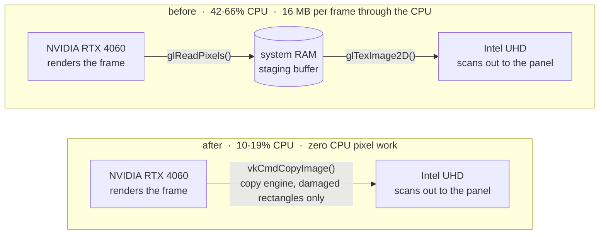

<div align="center">

# aquamarine-mgpu-copy-engine

### Your Optimus laptop should not burn a CPU core to display a still desktop.

A patch for [aquamarine](https://github.com/hyprwm/aquamarine) that removes the per-frame CPU
pixel copy from Hyprland's NVIDIA-render + Intel-scanout path and hands the work to the
discrete GPU's copy engine instead.

[](https://hyprland.org)
[](https://github.com/hyprwm/aquamarine)
[](https://www.vulkan.org)
[](https://www.nvidia.com)
[](https://archlinux.org)

[](#results)
[](#results)
[](#how-it-is-tested)
[](#license)
[](#-disclaimer)

</div>

---

## The problem

On a hybrid-graphics laptop (Intel iGPU driving the panel, NVIDIA dGPU doing the rendering)
Hyprland sat at **42-66% CPU while idle**, with music playing and nothing else happening.
Dropping to Intel-only compositing fixed the CPU but made the desktop feel sluggish.

The obvious suspect, a KMS atomic commit every vblank at 165 Hz, was wrong: only ~2% of the time
was spent in the kernel. A sampling profiler pointed at `libnvidia-eglcore` and `memcpy`, and
Hyprland was holding two 15.6 MB anonymous buffers, exactly `2560 x 1600 x 4` bytes each.

aquamarine could not share the frame between the two GPUs, so it was routing every frame through
the CPU:



**Why it fell back to the CPU.** Intel cannot import NVIDIA's buffer: i915 cannot map VRAM and
does not understand NVIDIA's block-linear layout. NVIDIA's GBM in turn refuses to allocate a
linear buffer, so aquamarine's "force linear for multi-GPU" attempt silently produced a tiled one
that Intel could not import either. With no shared path left, `blit()` took the `intermediateBuf`
branch: read every pixel back to the CPU, upload it to the other GPU, every frame, forever.

## The fix

Go the other way round. **The primary GPU's Vulkan device imports the secondary GPU's linear
scanout buffer, which lives in system memory, and writes into it with a dedicated transfer
queue.** The secondary never has to understand NVIDIA memory, and no CPU ever touches a pixel.

* Buffers on the NVIDIA side are allocated with a modifier that is both GL-renderable **and**
  Vulkan-importable, instead of the linear allocation that always failed.
* Intel's blit targets are allocated linear, so NVIDIA's Vulkan can import them.
* Synchronisation is explicit end to end: the compositor's render fence becomes a wait semaphore,
  and the copy exports a `sync_file` that becomes the KMS plane `IN_FENCE_FD`.
* Only the **damaged** part of each frame is copied, tracked per scanout buffer.
* Every failure path falls back to the original GL blit, and the whole thing can be switched off
  with a single environment variable.

## Results

Same machine, same workload as the original complaint: music playing, an audio visualiser
animating, ~165 flips per second.

| | before | after |
|---|--:|--:|
| Hyprland CPU (`top`) | 42-66% | **10-19%** |
| user / kernel time | 43% / 2% | **10.7% / 3.1%** |
| `memcpy` share of profile samples | 27% | **~1.5%** |
| bytes copied per frame by the CPU | 16 MB | **0** |
| copy-engine copies observed | - | 44 000+, zero failures |

The CPU that remains is Hyprland rendering the animating region with blur, which is compositor
work, not transport cost.

<sub>Lenovo Legion 5 16IRX9 · i5-13450HX + RTX 4060 Laptop · 2560x1600@165Hz · Hyprland 0.56.2 ·
aquamarine 0.15.0 · nvidia 610.57.04 · kernel 7.2.2 · CachyOS</sub>

## Quick start

> [!WARNING]
> This replaces a system library that your graphical session has mapped. Install it from a text
> TTY, not from inside the Hyprland session whose library you are replacing. And never `cp` over a
> shared library in place, it corrupts the running process. The tooling here does it correctly.

```bash
git clone https://github.com/Andarriel/aquamarine-mgpu-copy-engine
cd aquamarine-mgpu-copy-engine/packaging

# Arch / CachyOS: build and install it as a real package, so that `pacman -Syu`
# can never silently restore the slow path
makepkg -si
```

Log out and back in, then check that it took:

```bash
AQ_MGPU_VK_DEBUG=1 Hyprland 2>&1 | grep aq-vk
```

Going back is one command: `sudo pacman -S aquamarine`.

### Environment switches

| variable | effect |
|---|---|
| `AQ_MGPU_NO_VULKAN=1` | disable the copy engine entirely, use the original GL path |
| `AQ_MGPU_VK_FULL_COPIES=1` | copy whole frames, ignore damage tracking |
| `AQ_MGPU_VK_DEBUG=1` | trace every copier, allocator and blit decision to stderr |
| `AQ_MGPU_VK_SYNC=1` | never hand fences to KMS, wait on the CPU instead |
| `AQ_MGPU_VK_BARRIER=0\|1\|2` | image-ownership barrier style, for debugging |

## How it works

`CVulkanCopier` (`src/backend/drm/VulkanCopy.{hpp,cpp}` in the patch) lives on the primary GPU's
renderer and is created lazily on the first blit. It `dlopen`s `libvulkan.so.1`, so the library
gains **no new link-time dependency** and simply skips the fast path when Vulkan is unavailable.

1. **Device matching** picks the `VkPhysicalDevice` whose `VK_EXT_physical_device_drm` major and
   minor numbers match the DRM node aquamarine is already using.
2. **Queue selection** prefers a transfer-only family, so copies run on the dedicated copy engines
   instead of competing with the compositor's 3D work.
3. **Import caching** attaches a `VkImage` to each buffer once, created with
   `VK_IMAGE_TILING_DRM_FORMAT_MODIFIER_EXT` and the exact stride and offset of the dma-buf.
4. **Damage tracking**: the secondary swapchain rotates, so a buffer skipped for a few frames still
   owes their damage. Every destination carries a `stale` region; a copy transfers
   `stale ∪ this frame's damage`, clears its own, and adds the damage to every other live
   destination. A destination that owes nothing is skipped outright, with no copy and no fence.
5. **Synchronisation**: the client's render fence is imported into a wait semaphore, the copy
   signals a semaphore exported as a `sync_file`, and that becomes the plane's `IN_FENCE_FD`.
   Modeset commits and outputs without explicit sync fall back to a bounded CPU wait.
6. **Failing safe**: every wait is bounded, the first copy's fence must be seen signalling within
   500 ms or the path disables itself, and three failures revert to GL permanently.

### The bug that ate an evening

The first install made Hyprland hang during startup. No crash, no kernel complaint, just a
compositor sitting in `poll()` forever. An `LD_PRELOAD` shim on `connect()` printed the answer:

```
[connect-trace] connect() to '@/tmp/.X11-unix/X99' from:
  libxcb.so.1     xcb_connect_to_display_with_auth_info
  libX11.so.6     XOpenDisplay
  libGLX_nvidia.so.0  vk_icdNegotiateLoaderICDInterfaceVersion
  libvulkan.so.1  vkCreateInstance
```

**NVIDIA's Vulkan driver calls `XOpenDisplay($DISPLAY)` from inside `vkCreateInstance`.** In a
compositor, `$DISPLAY` is that compositor's own Xwayland socket, which it serves lazily, so
Hyprland connected to itself and waited forever. Any compositor initialising Vulkan with
`DISPLAY` set will hit this. The copier now hides `DISPLAY` and `WAYLAND_DISPLAY` while it
initialises Vulkan.

## How it is tested

Correctness here is not "the desktop looks fine". Two harnesses drive the real library code with
real buffers on both GPUs and compare actual pixels.

| test | what it proves | result |
|---|---|--:|
| `tools/mgpu_e2e.cpp` | NVIDIA GL renders, EGL fence, copy, and the Intel buffer holds the right frame | 100/100 frames |
| `tools/mgpu_damage.cpp` | rotating destinations, one small damaged rectangle per frame, **all 4 096 000 pixels** of the destination verified every frame | 800/800 frames |

The damage test earned its keep by finding two real bugs:

* **Consecutive copies into the same image were unordered.** Vulkan gives no ordering between
  separate queue submissions, so an earlier copy could land *after* a later one. Each destination
  now records which slot last wrote it and waits on that fence first.
* **A destination whose pages its owner has never touched loses scattered pixels.** The first
  copies into a brand-new Intel buffer left ~0.5% of pixels untouched. Harmless in the real path,
  since aquamarine already clears scanout buffers from the Intel side, but the first two copies
  into any new import are now full regardless.

Supporting tools, all written for this investigation:

| tool | purpose |
|---|---|
| `tools/sampler.c` + `symbolize.py` | `perf_event_open` CPU profiler, because `perf` was not installed |
| `tools/dmabuf_test.c` | the full GBM x PRIME x EGL import matrix between the two GPUs |
| `tools/vk_test.c` | Vulkan feasibility: modifier support, dma-buf import, copy timing, `sync_file` round trips |
| `tools/hypr_like.c` | replica of the compositor's process state, for reproducing the startup hang |
| `tools/connect_trace.c` | `LD_PRELOAD` `connect()` tracer with backtraces |
| `tools/fake_x11.py`, `fake_wayland.py` | sockets that accept connections and never answer |

## Layout

```
aquamarine-mgpu-copy-engine.patch   the patch itself, against aquamarine v0.15.0
packaging/PKGBUILD                  aquamarine-mgpu: provides and conflicts with aquamarine
tools/                              tests, profilers, probes, install and measurement scripts
diag/                               raw logs and measurements from the real runs
CHANGES.md                          every change and every dead end, in order
IMPROVEMENTS.md                     what is left, ranked, with risks
CLAUDE.md                           orientation for an AI agent picking this up
```

## Status and scope

This is a working patch for one specific and rather common configuration, not a merged upstream
feature. The copy-engine path has been running as the daily driver on the machine above; the
damage-limited refinement on top of it is verified by the pixel tests below and by a full TTY
session, and is what the package builds. Paths that are implemented but not yet exercised in
anger are listed honestly in [IMPROVEMENTS.md](IMPROVEMENTS.md): DPMS and lid cycles,
VT switching, suspend and resume, 10-bit and HDR formats, and external monitors wired to the
discrete GPU. Related upstream work: aquamarine
[PR #161](https://github.com/hyprwm/aquamarine/pull/161) covers the same-vendor dual-GPU case
through host memory, which is complementary to this.

## License

The patch modifies aquamarine and is offered under the same **BSD-3-Clause** licence as upstream.
The tools, scripts and documentation here are offered under the same terms.

---

## 🤖 Disclaimer

> **Every line of this project was designed, written, debugged and documented by
> [Claude Fable 5.1](https://www.anthropic.com/claude), Anthropic's model, running in
> [Claude Code](https://claude.com/claude-code).**
>
> Not "AI-assisted", not autocompleted. The whole thing: forming the hypothesis that the reported
> cause was wrong and proving it with measurements, writing a `perf_event_open` sampler from
> scratch because `perf` was not installed, demonstrating with test programs that the two GPUs
> genuinely cannot share a buffer, discovering that NVIDIA's Vulkan *can* import Intel's scanout
> memory, designing and implementing the copy-engine path, tracing a compositor deadlock down to
> `XOpenDisplay` being called inside `vkCreateInstance` using an `LD_PRELOAD` shim, building
> pixel-exact test harnesses, finding and fixing two of its own concurrency and initialisation
> bugs with them, packaging the result, and writing every word of this README.
>
> The human in the loop supplied the laptop, the problem, and the root password. He ran the
> commands that needed a real terminal, watched the screen for artifacts, and decided what was
> worth building. That division of labour is the point: the machine did the engineering, the human
> kept it pointed at something real.
>
> Every measurement here was taken on that hardware and is reproducible with the scripts in
> `tools/`. Where something has not been tested, it says so.

<div align="center">
<sub>Built in a single session on 2026-09-05 · <a href="CHANGES.md">read the full engineering log</a></sub>
</div>
